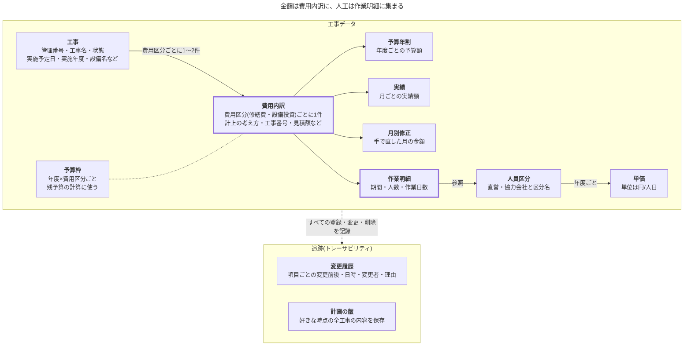

# 保全工事計画管理ツール 設計書

2026-10-04 · YANAi Taketo

## 1. 概要と要件

設備・工場保全の工事を予算段階から1件ずつ登録し、金額(予算額・見積額・実績額)と人工を、年度の四半期ごとに山積みして集計するツールです。主な用途は、予算枠を確保するための必要額の計算と、残予算の把握です。

### 管理する項目

| 項目 | 内容 |
| --- | --- |
| 工事 | 実施したい保全工事を1件ずつ登録する。予算段階から登録できる。工事名・設備名・設置場所・担当者・担当部署・協力会社名・優先度・備考を持つ |
| 工事番号 | 契約・令達以降に発行される番号。修繕費と設備投資それぞれに持てる。予算段階では空欄とし、発行後に追加する |
| 費用区分 | 修繕費と設備投資。1件の工事で両方が混在する場合は、金額を費用区分ごとの内訳で持つ |
| 予算額 | 費用区分ごと・年度ごとに持つ(年割額)。初期値は「人工×単価+その他の費用(材料費など)」で総額を計算し、計上の考え方で各年度に割り振る。どちらも手で直せる |
| 見積額 | 工事ごとの見積金額<br>費用区分ごとに持ち、見積書の金額を税抜で入力する |
| 実績額 | 費用区分ごと・月ごとの実績額。請求書などの金額を入力する |
| 予算枠 | 年度×費用区分ごとの予算枠(令達額)。残予算の計算に使う |
| 作業明細 | 期間・人員区分・人数・作業日数の行を、1件の工事に複数持てる。人工(人数×作業日数)は行ごとに計算する |
| 人員区分 | 直営と協力会社を分けて管理する。直営・協力会社それぞれの下に区分名を自由に登録でき、単価(円/人日)は区分ごと・年度ごとに持つ |
| 作業期間 | 実施予定の開始日と終了日。日付が決まっていない工事も、予算を管理するために登録できる。年度だけを決めておくこともできる |
| 状態 | 計画中・承認済み・発注済み・施工中・完了・中止 |
| 計上の考え方 | 費用区分の内訳ごとに、出来高か完成工事高のどちらかを選ぶ。1件の工事で、修繕費は出来高、設備投資は完成工事高のように分けられる |
| 四半期山積み | 金額と人工を年度の四半期(1Q〜4Q)ごとに集計する。集計に含める状態を選べる |

### 集計のルール

- 予算枠・予算額・見積額・実績額・単価は、すべて税抜で扱う。
- 金額は、費用区分の内訳ごとに選んだ計上の考え方に従って月ごとに割り振る。
  - 出来高:工事期間の暦日数に比例して割り振る。月ごとの値は手で直せる。
  - 完成工事高:工事終了日の月に全額を計上する。
- 予算額は、年度ごとの値(年割額)を、その年度の中で計上の考え方に従って月ごとに割り振る。
- 実績額は月ごとに入力し、入力した月に計上する。
- 人工は、作業明細の行ごとに、その行の期間の暦日数に比例して月ごとに割り振る。
- 山積みに使う金額は、予算額・見積額・実績額から集計のときに選ぶ。
- 日付が決まっていない工事は、四半期とは別に「時期未定」の欄で合計する。年度だけ決まっている工事は、その年度の「時期未定」の欄に入れる。
- 残予算は、年度×費用区分ごとに「予算枠 − 実績額の合計」で求める。
- 見込み残は、「残予算 − 発注済み・施工中の工事の見積額のうち、まだ実績になっていない分」で求める。

### 変更の追跡

- 工事の登録・変更・削除について、誰が・いつ・何をどう変えたかを後から追えるようにする。
  - 変更履歴:項目ごとに、変更前と変更後の値・日時・変更者を記録する。金額と日付を変えるときは、変更理由も入力できる。
  - 削除:データは実際には消さず、「削除済み」として残す。
  - 計画の版:好きな時点で全工事の内容を版として保存し、あとで現在の内容と比べられる。

### 前提

- 計算部分(期間の按分と四半期の集計)は画面と切り離して作り、Windowsアプリと社内Webアプリのどちらからも使えるようにする。
- 画面の方式は、計算部分ができてから決める。

### 対象外

- 工事の項目を利用者が自由に追加・削除する機能は持たない。必要な情報は備考に書く。
- 直営で確保できる人工と山積みを比べる機能は持たない。

## 2. 用語の定義

年度は4月始まりとし、四半期は1Q〜4Qと呼びます。

| 用語 | 意味 |
| --- | --- |
| 年度 | 4月1日から翌年3月31日までの1年間 |
| 四半期 | 年度を3か月ごとに分けた期間。1Q=4〜6月、2Q=7〜9月、3Q=10〜12月、4Q=1〜3月 |
| 人工 | 人数×作業日数で表す作業量。単位は人日 |
| 直営 | 自社の要員で行う作業 |
| 協力会社 | 社外の協力会社に依頼して行う作業 |
| 費用区分 | 工事の費用が修繕費と設備投資のどちらに当たるかの区分 |
| 工事番号 | 契約・令達以降に発行される工事の番号 |
| 出来高 | 工事の進み具合に応じて、工事期間中の各月に金額を割り振る考え方 |
| 完成工事高 | 工事が完成した時点で、金額を一括で計上する考え方 |
| 按分 | 金額や人工を月ごとに割り振ること |
| 山積み | 按分した金額や人工を、四半期ごとに合計したもの |
| 時期未定の工事 | 実施予定日が決まっていない工事 |

## 3. データ設計

データは、工事を中心とした11個のテーブルで管理します。金額は費用区分ごとの「費用内訳」に、人工は「作業明細」に持たせます。



工事1件の下に費用区分ごとの費用内訳が付き、予算年割・実績・月別修正・作業明細はその費用内訳にまとまります。

| テーブル | 主な内容 | つながり |
| --- | --- | --- |
| 工事 | 管理番号、工事名、状態、実施予定の開始日・終了日、実施年度、設備名などの情報 | 費用内訳を持つ |
| 費用内訳 | 費用区分、計上の考え方、工事番号、見積額、その他の費用 | 工事に属する。費用区分ごとに1件 |
| 予算年割 | 年度、予算額 | 費用内訳に属する。年度ごとに1件 |
| 実績 | 年月、実績額 | 費用内訳に属する |
| 月別修正 | 金額の種類(予算額・見積額)、年月、金額 | 費用内訳に属する |
| 作業明細 | 人員区分、開始日・終了日、人数、作業日数 | 費用内訳に属し、人員区分を参照する |
| 人員区分 | 直営・協力会社の別、区分名、予算額の計算に含めるか | 単価を持つ |
| 単価 | 年度、単価(円/人日) | 人員区分に属する。年度ごとに1件 |
| 予算枠 | 年度、費用区分、予算枠額 | 費用内訳の金額と、年度×費用区分で突き合わせる |
| 変更履歴 | 日時、変更者、対象、項目、変更前後の値、変更理由 | すべてのテーブルの変更を記録する |
| 計画の版 | 版の名前、保存日時、保存者、全工事の内容 | ほかのテーブルから独立 |

変更履歴と計画の版を除くテーブルには、共通して作成日時・作成者・更新日時・更新者・削除済みの印を持たせます。

### 項目の型

金額は円単位の整数(税抜)、年度は西暦4桁(例:2026は2026年4月〜2027年3月)、年月は西暦の年と月(例:2026-10)で表します。必須の「○」は、空欄を許さない項目です。

### 工事

| 項目 | 型 | 必須 | 説明 |
| --- | --- | --- | --- |
| ID | 整数 | ○ | 自動で振る |
| 管理番号 | 文字列 | ○ | 登録時にシステムが振る。重複なし。変更不可 |
| 工事名 | 文字列(100) | ○ |  |
| 状態 | 選択 | ○ | 計画中・承認済み・発注済み・施工中・完了・中止 |
| 開始日 | 日付 |  | 実施予定の開始日。未定なら空欄 |
| 終了日 | 日付 |  | 実施予定の終了日。開始日と終了日は、両方入れるか両方空欄にする |
| 実施年度 | 年度 |  | 開始日と終了日が空欄で、年度だけ決まっているときに入れる |
| 設備名 | 文字列(100) |  |  |
| 設置場所 | 文字列(100) |  |  |
| 担当者 | 文字列(50) |  |  |
| 担当部署 | 文字列(50) |  |  |
| 協力会社名 | 文字列(100) |  |  |
| 優先度 | 選択 |  | 高・中・低 |
| 備考 | 長文 |  |  |

### 費用内訳

| 項目 | 型 | 必須 | 説明 |
| --- | --- | --- | --- |
| ID | 整数 | ○ | 自動で振る |
| 工事ID | 整数 | ○ | 属する工事 |
| 費用区分 | 選択 | ○ | 修繕費・設備投資。1件の工事に同じ区分は1件まで |
| 計上の考え方 | 選択 | ○ | 出来高・完成工事高 |
| 工事番号 | 文字列(30) |  | 契約・令達以降に入れる。入れた場合は重複なし |
| 見積額 | 金額 |  | 見積書の金額 |
| その他の費用 | 金額 |  | 予算額の計算に使う材料費などの合計 |
| その他の費用の内容 | 文字列(200) |  |  |

### 予算年割

| 項目 | 型 | 必須 | 説明 |
| --- | --- | --- | --- |
| ID | 整数 | ○ | 自動で振る |
| 費用内訳ID | 整数 | ○ | 属する費用内訳 |
| 年度 | 年度 | ○ | 1件の費用内訳に同じ年度は1件まで |
| 予算額 | 金額 | ○ |  |

### 実績

| 項目 | 型 | 必須 | 説明 |
| --- | --- | --- | --- |
| ID | 整数 | ○ | 自動で振る |
| 費用内訳ID | 整数 | ○ | 属する費用内訳 |
| 年月 | 年月 | ○ | 計上する月 |
| 実績額 | 金額 | ○ | 同じ月に複数件入れてよい |
| 摘要 | 文字列(200) |  | 請求書番号など |

### 月別修正

計上の考え方が出来高の費用内訳で使います。

| 項目 | 型 | 必須 | 説明 |
| --- | --- | --- | --- |
| ID | 整数 | ○ | 自動で振る |
| 費用内訳ID | 整数 | ○ | 属する費用内訳 |
| 金額の種類 | 選択 | ○ | 予算額・見積額 |
| 年月 | 年月 | ○ | 費用内訳・金額の種類・年月の組み合わせで1件 |
| 金額 | 金額 | ○ | その月に計上する金額 |

### 作業明細

人工は保存せず、人数×作業日数で計算します。

| 項目 | 型 | 必須 | 説明 |
| --- | --- | --- | --- |
| ID | 整数 | ○ | 自動で振る |
| 費用内訳ID | 整数 | ○ | 属する費用内訳 |
| 人員区分ID | 整数 | ○ | 参照する人員区分 |
| 内容 | 文字列(100) |  | 準備、本作業など |
| 開始日 | 日付 |  | 未定なら空欄 |
| 終了日 | 日付 |  | 開始日と終了日は、両方入れるか両方空欄にする |
| 人数 | 整数 | ○ | 0以上 |
| 作業日数 | 小数(小数点以下1桁) | ○ | 0以上 |

### 人員区分

| 項目 | 型 | 必須 | 説明 |
| --- | --- | --- | --- |
| ID | 整数 | ○ | 自動で振る |
| 種別 | 選択 | ○ | 直営・協力会社 |
| 区分名 | 文字列(50) | ○ | 種別と区分名の組み合わせで重複なし |
| 予算額の計算に含める | 真偽 | ○ | 初期値は「含める」 |
| 表示順 | 整数 | ○ | 0以上 |
| 使用中 | 真偽 | ○ | 使わなくなった区分は選択肢から外す |

### 単価

| 項目 | 型 | 必須 | 説明 |
| --- | --- | --- | --- |
| ID | 整数 | ○ | 自動で振る |
| 人員区分ID | 整数 | ○ | 属する人員区分 |
| 年度 | 年度 | ○ | 人員区分と年度の組み合わせで1件 |
| 単価 | 金額 | ○ | 円/人日 |

### 予算枠

| 項目 | 型 | 必須 | 説明 |
| --- | --- | --- | --- |
| ID | 整数 | ○ | 自動で振る |
| 年度 | 年度 | ○ |  |
| 費用区分 | 選択 | ○ | 年度と費用区分の組み合わせで1件 |
| 予算枠額 | 金額 | ○ | 令達額 |

### 変更履歴

登録・変更・削除のどれも、項目ごとに1行で記録します。登録では変更前の値が空欄になり、削除は「削除済み」の印を付けた変更として記録します。

| 項目 | 型 | 必須 | 説明 |
| --- | --- | --- | --- |
| ID | 整数 | ○ | 自動で振る |
| 日時 | 日時 | ○ |  |
| 変更者 | 文字列(50) | ○ |  |
| 操作 | 選択 | ○ | 登録・変更・削除 |
| 操作番号 | 文字列(36) | ○ | 1回の保存でまとめて変えた項目を束ねる |
| 対象テーブル | 文字列(30) | ○ |  |
| 対象ID | 整数 | ○ |  |
| 工事ID | 整数 |  | 工事ごとに履歴を見るための参照 |
| 項目 | 文字列(50) | ○ |  |
| 変更前の値 | 長文 |  |  |
| 変更後の値 | 長文 |  |  |
| 変更理由 | 文字列(200) |  | 入力は任意 |

### 計画の版

| 項目 | 型 | 必須 | 説明 |
| --- | --- | --- | --- |
| ID | 整数 | ○ | 自動で振る |
| 版の名前 | 文字列(100) | ○ | 例:2027年度予算要求 |
| 保存日時 | 日時 | ○ |  |
| 保存者 | 文字列(50) | ○ |  |
| 説明 | 文字列(200) |  |  |
| 内容 | 長文 | ○ | 保存時点の工事・費用内訳・予算年割・実績・月別修正・作業明細・人員区分・単価・予算枠をまとめたもの |

## 4. 計算仕様

金額と人工は、まず月ごとの値に割り振り、その月の年度と四半期の欄に合計して山積みにします。割り振りの端数は最終月で調整するため、月ごとの値の合計は元の値と必ず一致します。

1. 人工を月ごとに割り振り、単価を当てて予算額の初期値を出す。
2. 予算額・見積額・実績額を、月ごとの値に割り振る。
3. 月ごとの値を、四半期・年度・時期未定の欄に合計する。
4. 年度×費用区分ごとに、残予算と見込み残を出す。

### 共通の決まり

割り振りはすべて暦日の比で行い、端数は最終月で調整します。

- 工期は、工事の開始日から終了日までの期間をいう。日数は暦日で数え、開始日と終了日を含める。例えば、2027-02-10〜2027-05-24は104日(2月19日・3月31日・4月30日・5月24日)。
- 月の年度と四半期は、その月で決まる。4〜6月が1Q、7〜9月が2Q、10〜12月が3Q、1〜3月が4Q。
- 割り振りでは、最終月以外の月を切り捨て、最終月には「元の値 − ほかの月の合計」を入れる。金額は1円単位、人工は0.1人工単位で切り捨てる。年度への割り振りも同じ方法で行い、最終年度で調整する。
- 最終月は、割り振り先の月のうち最も遅い月とする。月別修正があるときは、修正していない月のうち最も遅い月とする。
- 切り捨ては整数の割り算で求める。金額は「元の金額 × その月の日数」を期間の日数で割った商とする。人工は0.1人工を1とした整数で、同じ計算をする。
- 丸めるのは、割り振りと労務費(予算額の初期値)の計算だけとする。
- 削除済みの印を付けた行は、どの表のものも計算に使わない。人員区分の「使用中」は、計算には影響しない。

例えば、3,000,000円を上の104日に割り振ると、548,076/894,230/865,384/692,310円になる。

### 月への割り振り

金額は計上の考え方に従って、人工は作業明細の期間に従って、月ごとの値に割り振ります。

| 対象 | 出来高 | 完成工事高 |
| --- | --- | --- |
| 見積額 | 工期の各月に、暦日数の比で割り振る | 工事終了日の月に全額 |
| 予算額 | 年度ごとに、年割額を工期のうちその年度に入る各月へ、暦日数の比で割り振る | 終了日の年度の年割額は、終了日の月に全額。ほかの年度の年割額は、その年度の3月に全額 |
| 実績額 | 入力した月に計上する | 入力した月に計上する |
| 人工 | 作業明細の行ごとに、人数×作業日数をその行の期間の各月へ、暦日数の比で割り振る | 出来高と同じ |

- 出来高の費用内訳で、工期がその年度に1日もかからない年度の年割額は、その年度の3月に全額を計上する。
- 作業明細の日付が空欄の行は、工事の期間で割り振る。
- 作業明細の期間は、工事の期間の中だけ入力できる。工事の日付が空欄なら、作業明細の日付も入力できない。工期を変えて作業明細の期間が工期の外に出るときは、保存できない。工事と作業明細をまとめて直せば保存できる。
- 工事の日付が空欄のときは月に割り振らず、時期未定として扱う(山積みの集計を参照)。

月別修正は、出来高の費用内訳の見積額と予算額に使えます。修正できるのは、工期に入る月だけです。修正した月はその金額で固定し、残りを修正していない月に割り振ります。

- 見積額:見積額から修正した月の合計を引いた残りを、修正していない月に暦日数の比で割り振る。
- 予算額:年度ごとに、年割額からその年度で修正した月の合計を引いた残りを、その年度の修正していない月に割り振る。
- 修正した月の合計が見積額(予算額は年割額)を超えるときは保存できない。全部の月を修正するときは、合計が一致しなければ保存できない。見積額・年割額・月別修正のどれを変えるときも、この条件で確認する。
- 工期に入らない月の修正(工期を変えて期間外になったものを含む)と、計上の考え方を完成工事高に変えた費用内訳の修正は、計算に使わず、画面で知らせる。保存できるかどうかの確認にも数えない。
- 工期に入る月の修正でも、見積額が空欄の費用内訳の見積額の修正と、年割がない年度の予算額の修正は、計算に使わず、保存できるかどうかの確認にも数えない。見積額か年割額を入れれば使われるため、画面では知らせない。

### 予算額の初期値

予算額の初期値は、費用内訳ごとに「労務費 + その他の費用」で求め、その費用内訳の計上の考え方に従って年度に割り振ります。年割に入れた後は、手で直せます。

- 労務費は、作業明細の行ごと・年度ごとに「その年度の月に割り振った人工の合計 × その年度の単価」を求め、1円未満を切り捨てて合計する。単価は、その行の人員区分のものを使う。
- 人員区分で「予算額の計算に含める」にしていない区分の行は、労務費に入れない。この区分の単価は、登録がなくてよい。
- 工事の日付が空欄で実施年度があるときは、実施年度の単価を使う。実施年度も空欄のときは、初期値を出さない。
- 必要な年度の単価が登録されていないときは初期値を出さず、足りない単価を知らせる。
- 初期値は、利用者が出し直したときだけ年割に入れ直す。作業明細や単価を変えても、年割は自動では変わらない。

| 条件 | 年割の初期値 |
| --- | --- |
| 出来高 | 総額を、工期の暦日数を年度ごとに数えた比で割り振る |
| 完成工事高 | 工事終了日の年度に全額 |
| 工事の日付が空欄で、実施年度がある | 実施年度に全額 |

### 山積みの集計

月ごとの値を、その月の年度と四半期の欄に合計します。年度の合計は、1Q〜4Qと、その年度の時期未定の欄を足した値です。

| 集計の条件 | 選び方 |
| --- | --- |
| 金額の種類 | 予算額・見積額・実績額から1つ |
| 状態 | 含める状態を複数選ぶ |
| 費用区分 | 修繕費・設備投資の片方か両方 |

- 論理削除した工事は、どの条件でも含めない。
- 人工は、金額の種類によらず作業明細から求める。状態と費用区分の条件は、人工にも同じように当てる。
- 人工は、直営・協力会社の別と、区分名ごとの内訳も出す。

時期未定の欄には、日付が決まっていない工事の値を入れます。

- 工事の日付が空欄のとき、見積額と人工は時期未定の欄に入れる。実施年度があればその年度の時期未定の欄、なければ年度のない時期未定の欄に入れる。
- 予算額は、工事の日付が空欄のとき、年割の各年度の額をその年度の時期未定の欄に入れる。
- 実績額は、工事の日付によらず、入力した月の欄に入れる。

金額の種類で予算額か見積額を選んだとき、その金額が未入力の費用内訳は0円として集計し、未入力の件数を表の外に示します。予算額の未入力は、年割が1件もないことをいいます。

### 残予算と見込み残

残予算と見込み残は、年度×費用区分ごとに求めます。見込み残は、発注済み・施工中の工事でまだ実績になっていない見積額(未実績見込み)を、残予算から差し引いた値です。

- 残予算 = 予算枠 − その年度・費用区分の実績額の合計。実績額は入力した月の年度で数え、工事の状態によらず含める。論理削除した工事の実績額は含めない。
- 見込み残 = 残予算 − その年度・費用区分の未実績見込み。
- 予算枠が登録されていない年度・費用区分でも、実績額か未実績見込みがあれば、予算枠を0として行を出し、予算枠が未登録であることを示す。

未実績見込みは、状態が発注済み・施工中の工事について、費用内訳ごとに次の手順で求めて合計します。

1. 見積額の月ごとの値を年度ごとに合計し、年度配分とする。
2. その費用内訳の実績額の合計を、古い年度の年度配分から順に差し引く。年度配分が0になったら、次の年度から差し引く。
3. 各年度に残った額を、その年度の未実績見込みとする。集計基準日の年度より前の年度に残った額は、集計基準日の年度に移す。

- 集計基準日は集計のときに指定し、初期値は当日(日本時間)とする。
- 見積額が時期未定の欄に入る工事は、実施年度を年度配分の年度とする。実施年度もなければ、集計基準日の年度とする。
- 実績額の合計が見積額以上なら、未実績見込みは0とする。
- 論理削除した工事は含めない。

### 計算例

次の4件の工事で、計算の期待値を示します。金額は円、人工は人日です。テストの期待値には、この節の値を使います。

単価は次のとおりです。人員区分は、どちらも「予算額の計算に含める」にしています。

| 人員区分 | 2026年度 | 2027年度 |
| --- | --- | --- |
| 直営 | 30,000 | 31,000 |
| 協力会社 | 45,000 | 46,500 |

工事と費用内訳(各工事に費用内訳が1件)

| 例 | 工事名 | 計上の考え方 | 状態 | 費用区分 | 工期 | 見積額 | その他の費用 |
| --- | --- | --- | --- | --- | --- | --- | --- |
| 例1 | ポンプ更新 | 出来高 | 施工中 | 修繕費 | 2027-02-10〜2027-05-24 | 3,000,000 | 500,000 |
| 例2 | 受変電設備更新 | 完成工事高 | 発注済み | 設備投資 | 2026-12-01〜2027-06-30 | 15,500,000 | 6,000,000 |
| 例3 | 冷却塔補修 | 出来高 | 計画中 | 修繕費 | 空欄(実施年度2027) | 空欄 | 200,000 |
| 例4 | 配管補修 | 出来高 | 承認済み | 修繕費 | 2026-11-01〜2026-12-15 | 900,000 | 500,000 |

作業明細

| 例 | 人員区分 | 人数 | 作業日数 | 期間 |
| --- | --- | --- | --- | --- |
| 例1 | 直営 | 2 | 10.5 | 2027-03-01〜2027-04-15 |
| 例1 | 協力会社 | 4 | 12.0 | 2027-02-10〜2027-05-24 |
| 例2 | 協力会社 | 6 | 40.0 | 2027-01-10〜2027-06-20 |
| 例3 | 直営 | 3 | 5.0 | 空欄 |
| 例4 | 直営 | 2 | 3.0 | 空欄 |

- 例1の月別修正:見積額の2027-03を1,200,000にする。
- 例1の実績:2027-02に400,000、2027-03に1,100,000。
- 予算枠:2026年度修繕費5,000,000、2027年度修繕費3,000,000、2027年度設備投資20,000,000。

予算額の初期値

| 例 | 労務費 | 予算額の初期値 | 年割の初期値 |
| --- | --- | --- | --- |
| 例1 | 2,834,400 | 3,334,400 | 2026年度 1,603,076、2027年度 1,731,324 |
| 例2 | 10,980,300 | 16,980,300 | 2027年度 16,980,300 |
| 例3 | 465,000 | 665,000 | 2027年度 665,000 |
| 例4 | 180,000 | 680,000 | 2026年度 680,000 |

例1の労務費は、直営が14.1×30,000+6.9×31,000=636,900、協力会社が23.0×45,000+25.0×46,500=2,197,500です。例2の労務費は、119.8×45,000+120.2×46,500=10,980,300です。

月ごとの値(年割は初期値のまま)

| 例 | 年月 | 予算額 | 見積額 | 実績額 | 人工 |
| --- | --- | --- | --- | --- | --- |
| 例1 | 2027-02 | 609,168 | 468,493 | 400,000 | 8.7 |
| 例1 | 2027-03 | 993,908 | 1,200,000 | 1,100,000 | 28.4 |
| 例1 | 2027-04 | 961,846 | 739,726 | 0 | 20.7 |
| 例1 | 2027-05 | 769,478 | 591,781 | 0 | 11.2 |
| 例2 | 2027-01 | 0 | 0 | 0 | 32.5 |
| 例2 | 2027-02 | 0 | 0 | 0 | 41.4 |
| 例2 | 2027-03 | 0 | 0 | 0 | 45.9 |
| 例2 | 2027-04 | 0 | 0 | 0 | 44.4 |
| 例2 | 2027-05 | 0 | 0 | 0 | 45.9 |
| 例2 | 2027-06 | 16,980,300 | 15,500,000 | 0 | 29.9 |
| 例3 | 2027年度 時期未定 | 665,000 | 未入力 | 0 | 15.0 |
| 例4 | 2026-11 | 453,333 | 600,000 | 0 | 4.0 |
| 例4 | 2026-12 | 226,667 | 300,000 | 0 | 2.0 |

- 例1の人工は、直営が3月14.1・4月6.9、協力会社が2月8.7・3月14.3・4月13.8・5月11.2。
- 例1で月別修正をしない場合の見積額は、共通の決まりの例(3,000,000円の割り振り)と同じになる。
- 例2の年割を2026年度5,000,000・2027年度11,980,300に直すと、予算額は2027-03に5,000,000、2027-06に11,980,300となる。

山積み(状態はすべて、費用区分は両方)

| 欄 | 予算額 | 見積額 | 実績額 | 人工 |
| --- | --- | --- | --- | --- |
| 2026年度 3Q | 680,000 | 900,000 | 0 | 6.0 |
| 2026年度 4Q | 1,603,076 | 1,668,493 | 1,500,000 | 156.9 |
| 2026年度 合計 | 2,283,076 | 2,568,493 | 1,500,000 | 162.9 |
| 2027年度 1Q | 18,711,624 | 16,831,507 | 0 | 152.1 |
| 2027年度 時期未定 | 665,000 | 0 | 0 | 15.0 |
| 2027年度 合計 | 19,376,624 | 16,831,507 | 0 | 167.1 |

金額の3列は、金額の種類をそれぞれ選んで集計した値です。表にない欄はすべて0です。見積額で集計したときは、未入力1件(例3)を表の外に示します。人工の内訳は、2026年度3Qが直営6.0、4Qが直営14.1・協力会社142.8、2027年度1Qが直営6.9・協力会社145.2、2027年度時期未定が直営15.0です。

残予算と見込み残(集計基準日2027-03-31)

| 年度・費用区分 | 予算枠 | 実績額 | 残予算 | 未実績見込み | 見込み残 |
| --- | --- | --- | --- | --- | --- |
| 2026年度 修繕費 | 5,000,000 | 1,500,000 | 3,500,000 | 168,493 | 3,331,507 |
| 2027年度 修繕費 | 3,000,000 | 0 | 3,000,000 | 1,331,507 | 1,668,493 |
| 2027年度 設備投資 | 20,000,000 | 0 | 20,000,000 | 15,500,000 | 4,500,000 |

- 例1の未実績見込みは、年度配分(2026年度1,668,493・2027年度1,331,507)から、実績1,500,000を2026年度分から差し引いた値。
- 例3は計画中、例4は承認済みのため、未実績見込みに含めない。
- 集計基準日を2027-04-01にすると、例1の2026年度の残り168,493が2027年度に移る。2026年度修繕費の見込み残は3,500,000、2027年度修繕費の見込み残は1,500,000になる。

### 計算例(費用内訳ごとに計上の考え方が違う工事)

例5は、1件の工事のうち、修繕費の内訳を出来高で各月に、設備投資の内訳を完成工事高で終了月に計上する例です。人工は、計上の考え方によらず作業明細の期間に入ります。例5は、上の山積みと残予算の表には含めません。

工事:例5 ボイラー更新(状態は発注済み、工期は2027-04-01〜2027-09-30)

| 費用内訳 | 計上の考え方 | 見積額 | その他の費用 | 作業明細 |
| --- | --- | --- | --- | --- |
| 修繕費 | 出来高 | 2,400,000 | 300,000 | 協力会社 3人×20.0日(2027-04-01〜2027-09-30) |
| 設備投資 | 完成工事高 | 8,000,000 | 7,500,000 | 直営 2人×3.0日(2027-06-01〜2027-06-30) |

予算額の初期値は、修繕費が3,090,000(労務費60.0×46,500=2,790,000)、設備投資が7,686,000(労務費6.0×31,000=186,000)です。年割の初期値は、どちらも2027年度に全額です。

| 費用内訳 | 年月 | 予算額 | 見積額 | 人工 |
| --- | --- | --- | --- | --- |
| 修繕費 | 2027-04 | 506,557 | 393,442 | 9.8 |
| 修繕費 | 2027-05 | 523,442 | 406,557 | 10.1 |
| 修繕費 | 2027-06 | 506,557 | 393,442 | 9.8 |
| 修繕費 | 2027-07 | 523,442 | 406,557 | 10.1 |
| 修繕費 | 2027-08 | 523,442 | 406,557 | 10.1 |
| 修繕費 | 2027-09 | 506,560 | 393,445 | 10.1 |
| 設備投資 | 2027-06 | 0 | 0 | 6.0 |
| 設備投資 | 2027-09 | 7,686,000 | 8,000,000 | 0 |

| 欄(費用区分は両方) | 予算額 | 見積額 | 人工 |
| --- | --- | --- | --- |
| 2027年度 1Q | 1,536,556 | 1,193,441 | 35.7 |
| 2027年度 2Q | 9,239,444 | 9,206,559 | 30.3 |
| 2027年度 合計 | 10,776,000 | 10,400,000 | 66.0 |

実績がないため、未実績見込みは2027年度の修繕費に2,400,000、設備投資に8,000,000となります。

### 計算例(月への割り振り)

例6〜例16は、規則ごとの期待値を示す例です。各例は独立しており、例1〜5やほかの例と合わせて集計しません。人員区分は「種別・区分名」で書き、単価は次の表を使います。

| 人員区分 | 予算額の計算に含める | 使用中 | 2026年度 | 2027年度 | 2028年度 |
| --- | --- | --- | --- | --- | --- |
| 直営・機械 | はい | はい | 30,000 | 31,000 | 32,000 |
| 直営・電気 | はい | はい | 32,345 | 33,333 | 未登録 |
| 協力会社・一般 | はい | はい | 45,000 | 46,500 | 48,000 |
| 協力会社・応援 | いいえ | いいえ | 未登録 | 未登録 | 未登録 |

#### 例6 搬送コンベヤ補修(月別修正と最終月)

工期は2026-12-01〜2027-05-31で、修繕費の内訳(出来高)だけを持ちます。見積額は1,820,000、年割は2026年度1,210,000・2027年度610,000です。月別修正は、見積額の2027-05を400,000、予算額の2027-01を500,000にします。

| 年月 | 予算額 | 見積額 |
| --- | --- | --- |
| 2026-12 | 244,555 | 291,523 |
| 2027-01 | 500,000 | 291,523 |
| 2027-02 | 220,888 | 263,311 |
| 2027-03 | 244,557 | 291,523 |
| 2027-04 | 300,000 | 282,120 |
| 2027-05 | 310,000 | 400,000 |

- 見積額は、最も遅い2027-05を修正したため、2027-04が最終月になる。
- 予算額の2026年度は、年割額から2027-01の修正を引いた710,000を12・2・3月に割り振り、3月が最終月になる。2027年度は修正がないため、年割額を4・5月に割り振る。

#### 例7 排水処理設備更新(うるう年と3年度の工期)

工期は2027-03-01〜2028-04-30(427日)で、2026〜2028年度の3年度にまたがります。2028年2月は29日です。修繕費の内訳(出来高)だけを持ち、見積額は4,270,000、その他の費用は0です。作業明細は、直営・機械1人×42.7日(日付は空欄)です。

予算額の初期値は1,323,600(労務費3.1×30,000+36.6×31,000+3.0×32,000)、年割の初期値は2026年度96,092・2027年度1,134,514・2028年度92,994です。

| 年月 | 予算額 | 見積額 | 人工 |
| --- | --- | --- | --- |
| 2027-03 | 96,092 | 310,000 | 3.1 |
| 2027-04 | 92,992 | 300,000 | 3.0 |
| 2027-05 | 96,092 | 310,000 | 3.1 |
| 2027-06 | 92,992 | 300,000 | 3.0 |
| 2027-07 | 96,092 | 310,000 | 3.1 |
| 2027-08 | 96,092 | 310,000 | 3.1 |
| 2027-09 | 92,992 | 300,000 | 3.0 |
| 2027-10 | 96,092 | 310,000 | 3.1 |
| 2027-11 | 92,992 | 300,000 | 3.0 |
| 2027-12 | 96,092 | 310,000 | 3.1 |
| 2028-01 | 96,092 | 310,000 | 3.1 |
| 2028-02 | 89,893 | 290,000 | 2.9 |
| 2028-03 | 96,101 | 310,000 | 3.1 |
| 2028-04 | 92,994 | 300,000 | 3.0 |

#### 例8 照明設備更新(工期がかからない年度の年割額)

工期は2027-07-01〜2027-08-31で、修繕費の内訳(出来高)だけを持ちます。見積額は800,000、年割は2026年度200,000・2027年度620,000です。2026年度には、工期が1日もかかりません。

| 年月 | 予算額 | 見積額 |
| --- | --- | --- |
| 2027-03 | 200,000 | 0 |
| 2027-07 | 310,000 | 400,000 |
| 2027-08 | 310,000 | 400,000 |

- 2026年度の年割額は、その年度の3月(2027-03)に全額を計上する。

#### 例9 弁の交換(短い期間)

工期は2027-01-31〜2027-02-01(2日)で、修繕費の内訳(出来高)だけを持ちます。見積額は100,001、その他の費用は0です。作業明細は、直営・機械2人×1.5日(日付は空欄)と、直営・機械1人×0.5日(2027-02-01〜2027-02-01)の2行です。

予算額の初期値は105,000(労務費3.0×30,000+0.5×30,000)、年割の初期値は2026年度105,000です。

| 年月 | 予算額 | 見積額 | 人工 |
| --- | --- | --- | --- |
| 2027-01 | 52,500 | 50,000 | 1.5 |
| 2027-02 | 52,500 | 50,001 | 2.0 |

- 2行目の作業明細は期間が1日で、人工0.5は2027-02に入る。

### 計算例(予算額の初期値)

#### 例10 制御盤改修(労務費の切り捨てと、計算に含めない区分)

工期は2027-03-01〜2027-04-30で、修繕費の内訳(出来高)だけを持ちます。その他の費用は100,000です。作業明細は次の3行です。

| 行 | 人員区分 | 人数 | 作業日数 | 期間 |
| --- | --- | --- | --- | --- |
| 1 | 直営・電気 | 1 | 1.0 | 2027-03-31〜2027-04-01 |
| 2 | 直営・電気 | 1 | 0.5 | 2027-04-10〜2027-04-10 |
| 3 | 協力会社・応援 | 2 | 3.0 | 空欄 |

| 行 | 年度 | 人工 | 単価 | 労務費 |
| --- | --- | --- | --- | --- |
| 1 | 2026年度 | 0.5 | 32,345 | 16,172 |
| 1 | 2027年度 | 0.5 | 33,333 | 16,666 |
| 2 | 2027年度 | 0.5 | 33,333 | 16,666 |

労務費の合計は49,504、予算額の初期値は149,504です。年割の初期値は、2026年度75,977・2027年度73,527です。

- 1円未満は、行ごと・年度ごとに切り捨てる。2027年度の2行の人工を足してから単価を掛けると33,333になるが、期待値は16,666+16,666=33,332。
- 3行目は「予算額の計算に含める」にしていない区分のため、労務費に入れない。この区分の単価は未登録だが、初期値は出す。

#### 例11 消火設備更新・屋根補修(初期値を出さない場合)

例11Aは、工期が2028-03-01〜2028-04-30で、修繕費の内訳(出来高)に、直営・電気1人×2.0日と協力会社・応援1人×1.0日(どちらも日付は空欄)の作業明細を持ちます。その他の費用は50,000です。例11Bは、工期と実施年度が空欄で、修繕費の内訳(出来高)に直営・機械2人×2.0日の作業明細を持ちます。その他の費用は100,000です。

| 例 | 予算額の初期値 | 知らせる内容 |
| --- | --- | --- |
| 例11A | 出さない | 足りない単価:直営・電気の2028年度 |
| 例11B | 出さない | なし |

- 例11Aの直営・電気の人工は、2028-03(2027年度)と2028-04(2028年度)に1.0ずつ入る。2027年度の単価はあるが、2028年度の単価がない。
- 協力会社・応援は「予算額の計算に含める」にしていないため、単価がなくても足りない単価に数えない。

### 計算例(山積みの集計)

例12A〜例12Eの5件で、集計の条件による違いを示します。例12Eは論理削除した工事です。

| 例 | 工事名 | 状態 | 工期 |
| --- | --- | --- | --- |
| 例12A | 給水ポンプ補修 | 施工中 | 2027-04-01〜2027-06-30 |
| 例12B | 受電盤更新 | 計画中 | 2027-07-01〜2027-08-31 |
| 例12C | 計装設備更新 | 承認済み | 空欄(実施年度2027) |
| 例12D | 外壁補修 | 計画中 | 空欄(実施年度も空欄) |
| 例12E | 旧設備撤去 | 施工中 | 2027-04-01〜2027-04-30 |

| 例 | 費用区分 | 計上の考え方 | 見積額 | 年割 | 実績 |
| --- | --- | --- | --- | --- | --- |
| 例12A | 修繕費 | 出来高 | 910,000 | 2027年度 900,000 | なし |
| 例12B | 修繕費 | 出来高 | 620,000 | 2027年度 600,000 | なし |
| 例12B | 設備投資 | 完成工事高 | 2,000,000 | 2027年度 2,100,000 | なし |
| 例12C | 修繕費 | 出来高 | 500,000 | 2027年度 300,000、2028年度 200,000 | 2027-09に50,000 |
| 例12D | 修繕費 | 出来高 | 300,000 | なし | なし |
| 例12E | 修繕費 | 出来高 | 1,000,000 | 2027年度 1,000,000 | なし |

| 例 | 費用区分 | 人員区分 | 人数 | 作業日数 | 期間 |
| --- | --- | --- | --- | --- | --- |
| 例12A | 修繕費 | 直営・機械 | 1 | 9.1 | 空欄 |
| 例12A | 修繕費 | 直営・電気 | 1 | 3.0 | 2027-05-01〜2027-05-31 |
| 例12A | 修繕費 | 直営・機械 | 5 | 5.0 | 空欄 |
| 例12B | 修繕費 | 協力会社・一般 | 2 | 3.1 | 空欄 |
| 例12B | 設備投資 | 協力会社・応援 | 1 | 2.0 | 2027-08-01〜2027-08-31 |
| 例12C | 修繕費 | 直営・機械 | 1 | 4.0 | 空欄 |
| 例12D | 修繕費 | 協力会社・一般 | 2 | 1.5 | 空欄 |
| 例12E | 修繕費 | 直営・機械 | 10 | 3.0 | 空欄 |

例12Aの3行目の作業明細は、削除済みの印を付けた行です。

集計の条件1:状態はすべて、費用区分は両方

| 欄 | 予算額 | 見積額 | 実績額 | 人工 |
| --- | --- | --- | --- | --- |
| 2027年度 1Q | 900,000 | 910,000 | 0 | 12.1 |
| 2027年度 2Q | 2,700,000 | 2,620,000 | 50,000 | 8.2 |
| 2027年度 時期未定 | 300,000 | 500,000 | 0 | 4.0 |
| 2027年度 合計 | 3,900,000 | 4,030,000 | 50,000 | 24.3 |
| 2028年度 時期未定 | 200,000 | 0 | 0 | 0.0 |
| 2028年度 合計 | 200,000 | 0 | 0 | 0.0 |
| 年度のない時期未定 | 0 | 300,000 | 0 | 3.0 |

表にない欄は、すべて0です。人工の内訳は、2027年度1Qが直営・機械9.1・直営・電気3.0、2Qが協力会社・一般6.2・協力会社・応援2.0、時期未定が直営・機械4.0、年度のない時期未定が協力会社・一般3.0です。未入力の件数は、予算額で集計したときが1件(例12D)、見積額で集計したときが0件です。

集計の条件2:状態は計画中以外、費用区分は両方

| 欄 | 予算額 | 見積額 | 実績額 | 人工 |
| --- | --- | --- | --- | --- |
| 2027年度 1Q | 900,000 | 910,000 | 0 | 12.1 |
| 2027年度 2Q | 0 | 0 | 50,000 | 0.0 |
| 2027年度 時期未定 | 300,000 | 500,000 | 0 | 4.0 |
| 2027年度 合計 | 1,200,000 | 1,410,000 | 50,000 | 16.1 |
| 2028年度 時期未定 | 200,000 | 0 | 0 | 0.0 |
| 2028年度 合計 | 200,000 | 0 | 0 | 0.0 |
| 年度のない時期未定 | 0 | 0 | 0 | 0.0 |

未入力の件数は、予算額・見積額とも0件です。

集計の条件3:状態はすべて、費用区分は修繕費だけ

| 欄 | 予算額 | 見積額 | 実績額 | 人工 |
| --- | --- | --- | --- | --- |
| 2027年度 1Q | 900,000 | 910,000 | 0 | 12.1 |
| 2027年度 2Q | 600,000 | 620,000 | 50,000 | 6.2 |
| 2027年度 時期未定 | 300,000 | 500,000 | 0 | 4.0 |
| 2027年度 合計 | 1,800,000 | 2,030,000 | 50,000 | 22.3 |
| 2028年度 時期未定 | 200,000 | 0 | 0 | 0.0 |
| 2028年度 合計 | 200,000 | 0 | 0 | 0.0 |
| 年度のない時期未定 | 0 | 300,000 | 0 | 3.0 |

未入力の件数は、予算額で集計したときが1件(例12D)、見積額で集計したときが0件です。

- 例12Eは論理削除しているため、どの条件でも含めない。例12Aの削除済みの作業明細も、人工に入れない。
- 協力会社・応援は使用中ではないが、人工には入る。
- 例12Cの予算額は、年割の各年度の時期未定の欄に入る。実績額は、工事の日付によらず、入力した月(2027-09)の欄に入る。

### 計算例(残予算と見込み残)

例13A〜例13Fの6件で、残予算と見込み残を示します。集計基準日は2027-10-31です。各工事の費用内訳は1件で、例13Fは論理削除した工事です。

| 例 | 工事名 | 状態 | 工期 | 費用区分(計上の考え方) | 見積額 | 実績 |
| --- | --- | --- | --- | --- | --- | --- |
| 例13A | 送風機更新 | 施工中 | 2027-02-01〜2027-05-31 | 修繕費(出来高) | 1,200,000 | 2027-03に500,000、2027-05に300,000、2027-04に100,000(削除済み) |
| 例13B | 熱交換器洗浄 | 施工中 | 2027-06-01〜2027-06-30 | 修繕費(出来高) | 400,000 | 2027-06に250,000、2027-07に200,000 |
| 例13C | 貯水槽更新 | 発注済み | 空欄(実施年度2028) | 修繕費(出来高) | 700,000 | なし |
| 例13D | 監視カメラ更新 | 発注済み | 空欄(実施年度も空欄) | 設備投資(完成工事高) | 300,000 | なし |
| 例13E | 煙突補修 | 中止 | 2026-11-01〜2026-11-30 | 修繕費(出来高) | 500,000 | 2026-11に120,000 |
| 例13F | 旧配管撤去 | 施工中 | 2027-04-01〜2027-04-30 | 修繕費(出来高) | 1,000,000 | 2027-04に600,000 |

予算枠は、2026年度修繕費2,000,000、2027年度修繕費3,000,000、2027年度設備投資1,000,000、2028年度修繕費1,500,000、2028年度設備投資500,000です。

| 年度・費用区分 | 予算枠 | 実績額 | 残予算 | 未実績見込み | 見込み残 |
| --- | --- | --- | --- | --- | --- |
| 2026年度 修繕費 | 2,000,000 | 620,000 | 1,380,000 | 0 | 1,380,000 |
| 2027年度 修繕費 | 3,000,000 | 750,000 | 2,250,000 | 400,000 | 1,850,000 |
| 2027年度 設備投資 | 1,000,000 | 0 | 1,000,000 | 300,000 | 700,000 |
| 2028年度 修繕費 | 1,500,000 | 0 | 1,500,000 | 700,000 | 800,000 |
| 2028年度 設備投資 | 500,000 | 0 | 500,000 | 0 | 500,000 |

- 例13Aの年度配分は、2026年度590,000・2027年度610,000。実績800,000を2026年度から差し引き、残りの210,000を2027年度から差し引くため、未実績見込みは2027年度の400,000になる。削除済みの2027-04の実績は数えない。
- 例13Bは、実績の合計450,000が見積額400,000以上のため、未実績見込みは0。
- 例13Cは実施年度の2028年度に、例13Dは実施年度がないため集計基準日の年度(2027年度)に、見積額の全額を配分する。
- 例13Eは中止だが、実績120,000を残予算に含める。未実績見込みには含めない。
- 例13Fは論理削除しているため、実績も未実績見込みも含めない。

集計基準日を2028-04-01にすると、例13Aの2027年度の400,000は2028年度に移り、例13Dの300,000は2028年度に配分されます。予算枠・実績額・残予算は変わりません。

| 年度・費用区分 | 未実績見込み | 見込み残 |
| --- | --- | --- |
| 2026年度 修繕費 | 0 | 1,380,000 |
| 2027年度 修繕費 | 0 | 2,250,000 |
| 2027年度 設備投資 | 0 | 1,000,000 |
| 2028年度 修繕費 | 1,100,000 | 400,000 |
| 2028年度 設備投資 | 300,000 | 200,000 |

例13に例13G(非常用発電機更新、状態は完了、工期2026-06-01〜2026-06-30、設備投資(完成工事高)、見積額800,000、2026-06に実績800,000)を足すと、予算枠が未登録の2026年度設備投資の行が増えます。集計基準日は2027-10-31で、ほかの行は変わりません。

| 年度・費用区分 | 予算枠 | 実績額 | 残予算 | 未実績見込み | 見込み残 |
| --- | --- | --- | --- | --- | --- |
| 2026年度 設備投資 | 0(未登録) | 800,000 | -800,000 | 0 | -800,000 |

### 計算例(保存できない条件と計算に使わない修正)

#### 例14 給湯配管更新(保存できない条件)

基本の状態は次のとおりで、このまま保存できます。工期は2027-04-01〜2027-06-30で、修繕費の内訳(出来高)だけを持ちます。見積額は900,000、年割は2027年度900,000です。月別修正は、見積額の2027-04を300,000、予算額の2027-06を400,000にしています。作業明細は、直営・機械1人×3.0日(2027-05-01〜2027-05-31)です。

次の表は、基本の状態を変えて保存したときの結果です(11は4の状態から変えます)。

| # | 変更 | 結果 |
| --- | --- | --- |
| 1 | 作業明細の期間を2027-06-15〜2027-07-10にする | 保存できない。作業明細の期間が工期の外にある |
| 2 | 工事の開始日と終了日を空欄にする | 保存できない。作業明細に日付がある |
| 3 | 工期を2027-05-15〜2027-08-31にする | 保存できない。作業明細の期間が工期の外に出る |
| 4 | 3と同時に、作業明細の期間を2027-06-01〜2027-06-30にする | 保存できる。見積額の2027-04の修正は工期に入らないため、計算に使わない |
| 5 | 見積額の2027-05に700,000の修正を足す | 保存できない。修正の合計1,000,000が見積額900,000を超える |
| 6 | 見積額の2027-05に300,000、2027-06に200,000の修正を足す | 保存できない。全部の月を修正し、合計800,000が見積額と一致しない |
| 7 | 見積額の2027-05に300,000、2027-06に300,000の修正を足す | 保存できる。全部の月を修正し、合計が見積額と一致する |
| 8 | 見積額を250,000にする | 保存できない。修正の合計300,000が見積額を超える |
| 9 | 予算額の2027-04に600,000の修正を足す | 保存できない。2027年度の修正の合計1,000,000が年割額900,000を超える |
| 10 | 2027年度の年割を300,000にする | 保存できない。修正の合計400,000が年割額を超える |
| 11 | 見積額を100,000にする | 保存できる。工期に入らない2027-04の修正は、確認に数えない |

#### 例15 冷凍機補修(計算に使わない修正)

工期は2027-05-15〜2027-08-31です。修繕費の内訳(出来高)は、見積額900,000、年割は2026年度100,000・2027年度800,000です。月別修正は、見積額の2027-04に300,000と2027-06に200,000、予算額の2027-03に50,000です。設備投資の内訳(完成工事高)は、見積額1,000,000、年割は2027年度1,000,000です。この内訳には、見積額の2027-06に400,000の月別修正が残っています。

| 費用内訳 | 年月 | 予算額 | 見積額 |
| --- | --- | --- | --- |
| 修繕費 | 2027-03 | 100,000 | 0 |
| 修繕費 | 2027-05 | 124,770 | 150,632 |
| 修繕費 | 2027-06 | 220,183 | 200,000 |
| 修繕費 | 2027-07 | 227,522 | 274,683 |
| 修繕費 | 2027-08 | 227,525 | 274,685 |
| 設備投資 | 2027-08 | 1,000,000 | 1,000,000 |

計算に使わず、画面で知らせる修正は次の3件です。

| 費用内訳 | 金額の種類 | 年月 | 金額 | 理由 |
| --- | --- | --- | --- | --- |
| 修繕費 | 見積額 | 2027-04 | 300,000 | 工期に入らない月 |
| 修繕費 | 予算額 | 2027-03 | 50,000 | 工期に入らない月 |
| 設備投資 | 見積額 | 2027-06 | 400,000 | 完成工事高の費用内訳 |

- 修繕費の2026年度には工期が1日もかからないため、その年割額100,000は2027-03に全額を計上する。2027-03は工期に入らないため、この月の予算額の修正は使わない。

#### 例16 空調ダクト更新(年度をまたぐ保存できない条件)

基本の状態は次のとおりで、このまま保存できます。工期は2027-02-01〜2027-05-31です。2027-02と2027-03は2026年度、2027-04と2027-05は2027年度の月です。

- 修繕費の内訳(出来高):見積額1,000,000、年割は2026年度400,000・2027年度600,000です。月別修正は、見積額の2027-02を300,000、予算額の2027-03を150,000、2027-04を200,000、2027-06を500,000にしています。
- 設備投資の内訳(出来高):見積額は空欄で、年割は2026年度300,000だけです。月別修正は、見積額の2027-04を900,000、予算額の2027-05を800,000にしています。

基本の状態では、次の修正を、保存できるかどうかの確認に数えません。

- 修繕費の予算額の2027-06:工期に入らない月の修正のため。
- 設備投資の見積額の修正:見積額が空欄のため。
- 設備投資の予算額の2027-05:2027年度の年割がないため。

次の表は、基本の状態を変えて保存したときの結果です。#7は、#1・#2・#5を同時に行います。

| # | 変更 | 結果 |
| --- | --- | --- |
| 1 | 修繕費の予算額の2027-02に300,000の修正を足す | 保存できない。2026年度の修正の合計450,000が年割額400,000を超える |
| 2 | 修繕費の予算額の2027-04の修正を700,000にする | 保存できない。2027年度の修正の合計700,000が年割額600,000を超える |
| 3 | 修繕費の予算額の2027-05に300,000の修正を足す | 保存できない。2027年度の全部の月を修正し、合計500,000が年割額600,000と一致しない |
| 4 | 修繕費の予算額の2027-05に400,000の修正を足す | 保存できる。2027年度の全部の月を修正し、合計600,000が年割額と一致する |
| 5 | 設備投資の見積額を500,000にする | 保存できない。修正の合計900,000が見積額500,000を超える |
| 6 | 設備投資に2027年度の年割500,000を足す | 保存できない。2027年度の修正の合計800,000が年割額500,000を超える |
| 7 | #1・#2・#5を同時に行う | 保存できない。修繕費は、2026年度の修正の合計450,000が年割額400,000を超え、2027年度の修正の合計700,000が年割額600,000を超える。設備投資は、修正の合計900,000が見積額500,000を超える |

- 2027-02と2027-03は、暦年では2027年ですが、2026年度の月です。そのため、#1の理由の年度は2026年度になります。
- #1では2026年度の全部の月を修正していますが、合計が年割額を超えるので、知らせるのは超えることだけです。
- #2〜#4の2027年度の合計には、工期に入らない2027-06の修正も、2026年度の2027-03の修正も数えません。
- #5と#6のように見積額や年割を入れると、それまで数えなかった設備投資の修正を数えるようになります。
- #7のように理由が2つ以上あるときは、すべての理由を知らせます。

## 5. 画面設計

画面のたたき台は「[保全工事計画管理ツール 画面のたたき台](https://claude.ai/artifact/3Ua35VrN5dPAB4knStN6AM)」にあります。

## 8. 実装計画

最初の工程で計算部分を作り、4章の計算例をすべてテストで確かめます。画面・データベース・出力は、その後の工程で作ります。

### 工程1 計算部分

計算部分は、画面・データベース・ファイルに依存しないクラスライブラリとして作ります。言語はC#、対象は.NET 10です。

| プロジェクト | 内容 |
| --- | --- |
| MaintPlan.Core | 4章の計算(月への割り振り、予算額の初期値、山積みの集計、残予算と見込み残)と、保存できない条件の確認 |
| MaintPlan.IO | 3章のテーブルの読み込みと、計算結果の書き出し。CSVはCsvHelper、ExcelはClosedXMLで読み書きする |
| MaintPlan.Cli | 確認用のコンソールアプリ |
| MaintPlan.Tests | xUnit.net v3のテスト。4章の計算例をテストデータにして確かめる |

#### 数値と日付

- 金額は円の整数、人工は0.1人工を1とした整数で持ち、計算の途中も整数で扱う。型は64ビット整数(long)とし、浮動小数点数は使わない。
- 作業日数(小数点以下1桁)は、10倍した整数で扱う。
- 日付は、時刻を持たない型(DateOnly)で扱う。

#### 入出力

- 読み込む列は3章の項目名とし、書き出す表は4章の計算例の表と同じ形にする。
- 工程1で読み込むのは、計算に使う9つのテーブル(工事、費用内訳、予算年割、実績、月別修正、作業明細、人員区分、単価、予算枠)とする。変更履歴と計画の版、共通の列のうち作成日時・作成者・更新日時・更新者は、工程2以降で扱う。削除済みの印は読む。
- CSVは、テーブルまたは結果の表ごとに1ファイルとし、文字コードはUTF-8(BOM付き)にする。日付はYYYY-MM-DD、年月はYYYY-MM、金額は桁区切りなしで書き、空欄は空の値とする。
- Excelは、1冊のブックにテーブルまたは結果の表ごとのシートを置き、1行目を列名にする。列はCSVと同じにする。
- 読み込むときに、3章の決まり(必須、重複なし、開始日と終了日は両方入れるか両方空欄)と、4章の保存できない条件を確かめ、当たるものはファイルまたはシートと行で示す。
- 確認用コンソールは、入力(CSVのフォルダかExcelブック)と出力先を受け取り、集計の条件(金額の種類、含める状態、費用区分、集計基準日)を指定できるようにする。書き出すのは、月ごとの値、予算額の初期値、山積みと人工の内訳、残予算と見込み残、計算に使わない修正の5つの表とする。

#### テストデータ

- 例1〜例16を、例ごとのフォルダのCSVにする。入力は3章のテーブルごと、期待値は4章の表ごとに1ファイルとする。
- 文中に書いた値と表の中の文も、期待値のファイルにする。保存できない条件は、保存できるかどうかと理由の種類で比べる。ファイルの形は段1で提案し、テストデータと一緒に確認を受ける。
- 例12は集計の条件1〜3、例13は集計基準日2027-10-31・2028-04-01と例13Gを足した場合、例14と例16は変更後の状態ごとに、入力と期待値を分ける。
- 年割は、計算例に書いた値を入力として与える。月ごとの値のテストは、年割の初期値の計算に頼らない。
- 期待値は、設計書の値をそのまま写す。実装の出力から期待値を作らない。

#### 作業の分け方

| 段 | 作るもの | 完了の条件 |
| --- | --- | --- |
| 1 | ソリューションと4つのプロジェクト、CSVの読み込み、例1〜例15のテストデータ | ビルドとテストが動き、全例の入力と期待値を読み込める。計算のテストは失敗してよい |
| 2 | 期間の数え方と月への割り振り(月別修正、時期未定、計算に使わない修正を含む) | 共通の決まりの例、例1〜例9、例15の月ごとの値と、計算に使わない修正が一致する |
| 3 | 予算額の初期値 | 例1〜例5、例7、例9〜例11の初期値と、初期値を出さない場合の結果が一致する |
| 4 | 山積みの集計 | 例1〜例5、例12の山積み、人工の内訳、未入力の件数が一致する |
| 5 | 残予算と見込み残 | 例1〜例5、例13の残予算と見込み残が一致する |
| 6 | 保存できない条件の確認 | 例14の11件の結果が一致する |
| 7 | 書き出し、Excelの読み込み、確認用コンソール | 例12と例13を、CSVとExcelのどちらから読んでも同じ結果を書き出せる。読み込み時の違反を行で示せる |

- 段1のテストデータは、段2に進む前に、設計書と見比べて確認を受ける。
- 工程1は、段1〜段7のテストがすべて通ったら完了とする。

## 9. CLAUDE.md(下書き)

リポジトリの直下に置くCLAUDE.mdの内容です。設計書はMarkdownに書き出し、docs/design.md に置きます。

```markdown
# CLAUDE.md

## このリポジトリ
設備・工場保全の工事計画管理ツール。仕様は docs/design.md(設計書)にある。今は8章の工程1(計算部分)を作っている。

## 構成
- src/MaintPlan.Core:4章の計算と、保存できない条件の確認。画面・DB・ファイルに依存させない
- src/MaintPlan.IO:CSV(CsvHelper)とExcel(ClosedXML)の読み書き
- src/MaintPlan.Cli:確認用のコンソールアプリ
- tests/MaintPlan.Tests:xUnit.net v3のテスト。テストデータは tests/data/ の例ごとのフォルダに置く

## コマンド
- ビルド:dotnet build
- テスト:dotnet test

## 守ること
- 仕様は設計書の3章・4章を正とする。仕様にない動きは足さず、分からない点は実装の前に質問する。
- テストの期待値は、設計書4章の計算例の値をそのまま使う。実装の出力から期待値を作らない。
- テストが通らないときは実装を直す。期待値や設計書が誤っていると思うときは、値を変えずに報告する。
- 金額と人工は整数(long)で計算する。人工と作業日数は10倍した整数で持つ。浮動小数点数は使わない。日付はDateOnlyで扱う。
- 対象は.NET 10。NuGetパッケージの版は固定し、プレリリース版は使わない。ClosedXMLの版を上げるときは、リリースノートと移行ガイドを確かめる。
- 8章の段を1つずつ進める。段が終わったら、通ったテストと残った課題を報告して、確認を待つ。
```
